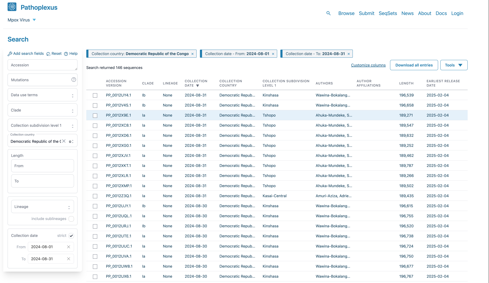
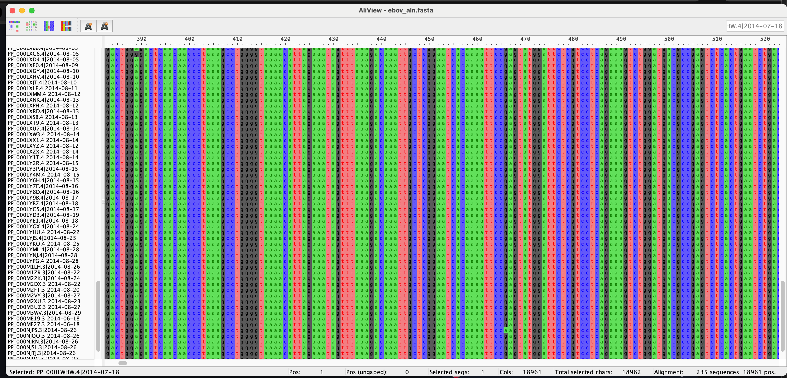
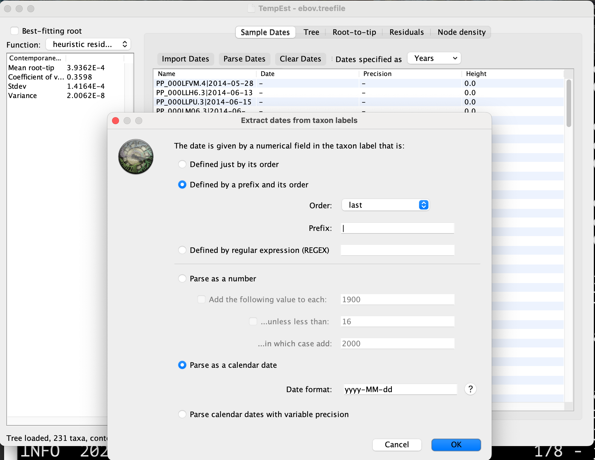
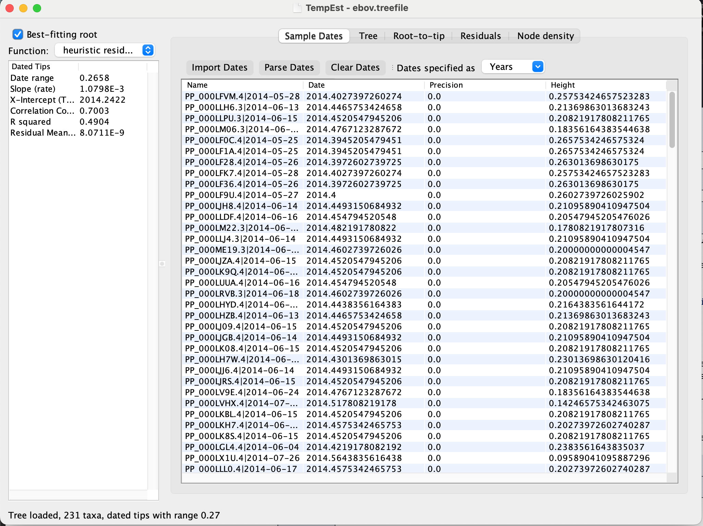

---
# **Quality control in phylogenetic analysis**
---
###### ***Trainer***: John Juma
---


## Tools and software

1. Installing conda. 

Note: We recommend installing the minimal version of conda such as miniconda or
miniforge https://docs.conda.io/projects/conda/en/latest/user-guide/install/index.html.

## Dataset 
We will construct a dataset containing about 50 Mpox virus sequences from the DRC. These sequences will be obtained from
Pathoplexus (https://pathoplexus.org/).

<br>
<left></left>
<br>


## Retrieving the data

We will collate data collected between August 01, 2024, and August 15, 2024 from
the Democratic Republic of Congo (DRC).

<br>
<left></left>
<br>


## Setting up the project directory

- **Create a working directory within the `acdc-mpox2025`**

	```
	cd
	```

	```
	mkdir -p ${HOME}/acdc_mpox2025/phylo/{data,output/{mafft,iqtree,squirrel},plots}
	```

	```
	cd ${HOME}/acdc_mpox2025/phylo
	```

- **Download the data from [Pathoplexus](https://pathoplexus.org/)**

	- On your web browser, go to https://pathoplexus.org/
	- Select `Mpox virus`
	- Under the `Collection country`, type Democractic Reuplic of the
	Congo
	- Under `Collection date`, select `FROM`: `2024-08-01` and `TO` and
	`2024-08-15`
	
	- Click on `Download aal entries` and:

		- Select `Metadata` as the `Data type`, agree to the terms and download
		the data without `compression`. Name this file as `metadata.tsv` and save in the `data` directory

		- Now select `Raw nucleotide sequences` as the next `Data type`. Agree
		to the terms of use and doenload the data and save as `mpox.fasta` in
		the `data` directory

If you dont have the data, use this command to download the data within your
`phylo` directory

```
wget -c https://github.com/ajodeh-juma/mpox-phylo/raw/refs/heads/master/data.zip
```

```
unzip data.zip
```

- Inspect the data

	- **Examine the `mpox.fasta` file that you downloaded?**

		```
		cat ./data/mpox.fasta
		```
    
    - **How many sequences are in the `mpox.fasta` file**

		```
		grep '>' ./data/mpox.fasta | wc -l
		```
        
    - **How many records are in the metadata `metadata.tsv` file**


		```
		wc -l ./data/metadata.tsv
		```
	The genome size of the [Monkeypos virus Zaire-96-I-16](https://www.ncbi.nlm.nih.gov/nuccore/NC_003310.1/) is **196858**
	


	- **How many genome sequences have the length of 196858**?
        
    - **What is the shortest sequence length among the sequence records in `metadata.tsv`**
    
    - **What is the longest sequence length among the sequence records in `metadata.tsv`**
    
    - **Count the number of unique sequences per length in bp**


It is considered good practice to have the sequence labels contain the sample
collection dates for molecular clock analysis. 

## Manipulate the data

We will manipulate the data using `seqkit`
(https://github.com/shenwei356/seqkit) to generate sequence headers with
accessions and sampling dates


1. Create a `conda` environment using the `environment.yaml`

	```
	wget https://raw.githubusercontent.com/ajodeh-juma/mpox-phylo/refs/heads/master/environment.yaml
	```

	```
	mamba env create -f environment.yaml
	```

	```
	conda activate phylo
	```

2. `seqkit` and `csvtk` are powerful tools that are often used to manipulate
   data in bioinformatics. Here we will use a combination of the tow to see the
   robust features of these tools.
   
   - match all lines beginning with `PP` then convert to tab while outputting
     GC, length and number of Ns in the genomes

		```
		seqkit grep -r -p '^PP' ./data/mpox.fasta \
		| seqkit fx2tab -l --gc -C N \
		| cut -f4,5,6
		```

	- plot distibution of genome lengths

		```
		seqkit grep -r -p '^PP' ./data/mpox.fasta \
		| seqkit fx2tab -l \
		| cut -f4 \
		| csvtk -H plot hist --xlab Length --title "MPOXV length distribution" -o ./plots/length-distribution.pdf
		```

	- plot boxplot of the GC content

		```
		seqkit grep -r -p '^PP' ./data/mpox.fasta \
		| seqkit fx2tab --gc \
		| cut -f4 \
		| csvtk -H plot box --ylab "GC-content" --xlab "Samples" --title "MPOXV GC content" -o ./plots/gc-content.pdf
		```

	- plot Ns distibution

		```
		seqkit grep -r -p '^PP' ./data/mpox.fasta \
		| seqkit fx2tab -C N \
		| cut -f4 \
		| csvtk -H plot hist --xlab "Ns" --title "MPOXV Ns content" -o ./plots/ns-content.pdf
		```


3. Compute the percentage coverage of the genomes and only retain those that
   have >99% genome coverage
   
   - get the minimum genome size to select
   
   		```
    	echo "scale=0; (0.99*196858)/1" | bc
		```


   - extract the accessions of the genomes whose genome sizes are greater or
     equal to the minimum size above (round off)

	 ```
	 tail -n+2 ./data/metadata.tsv | awk -F'\t' '{ if ($11 >= 194889)
	 print $1 }' > ./data/accessions_to_select.txt
	 ```
	 > **Note**
	 - **How many genomes have been filtered out? How many have been left after the filtering process?**

   - filter out the genomes
   
   		```
	   seqkit grep -f ./data/accessions_to_select.txt ./data/mpox.fasta > ./data/mpox_selected.fasta
		```

4. We will now extract the sequence ID using `seqkit seq` subcommand and manipulate the extracted IDs using `csvtk`

	```
	seqkit seq -n -i ./data/mpox_selected.fasta > ./data/accessions.txt
	```

	```
	tail -n+2 ./data/metadata.tsv | cut -f1,5 > ./data/accessions_dates.txt
	```

	```
	csvtk join -H -t ./data/accessions.txt ./data/accessions_dates.txt > ./data/accessions_keypairs.txt
	```

	```
	seqkit replace -p "(.+)" -r '$1|{kv}' -k ./data/accessions_keypairs.txt ./data/mpox_selected.fasta > ./data/mpox_renamed.fasta
	```

	<!-- ```
	conda deactivate
	``` -->

## Multiple sequence alignment
We will align the collected data using `MAFFT` (Nakamura et al. 2018) followed
by manual curation in `AliView` (Larsson, 2014).

<!-- ```
conda create -n mafft -c conda-forge -c bioconda mafft
``` -->

<!-- ```
conda activate mafft
``` -->

```
mafft --thread 4 ./data/mpox_renamed.fasta > ./output/mafft/mpox_aln.fasta
```
<!-- 
```
conda deactivate
``` -->


## Manually check the alignment and deduplicate sequences
We will assess the alignment in `AliView` to identify any issues.


> **Note**

- If you had downloaded the program file as given in the installation part:

	```
	aliview &
	```

	Start the `AliView` program and load the alignment file `mpox_aln.fasta`


<!-- - If you **were unable** to download AliView with the program files depending on your OS,
	You can use `conda`

	- create a conda environment
	```
	conda create -n aliview -c conda-forge -c bioconda aliview
	```

	- activate the environment

	```
	conda activate aliview
	```

	- start the program and load the alignment file `ebov_aln.fasta`
	```
	aliview
	```

	- deactivate the environment

	```
	conda activate seqkit
	``` -->


<br>
<left></left>
<br>


We will then remove duplicate sequences using `seqkit`.


```
seqkit rmdup -s -D  ./output/mafft/duplicates.txt < ./output/mafft/mpox_aln.fasta > ./output/mafft/mpox_dedup_aln.fasta
```
**How many duplicated records are in the alignment? List the accessions of the duplicated records**
<!-- 
```
conda deactivate
``` -->


## Maximum Likelihood tree inference

We will use `IQTREE` (Nguyen et al., 2014) to generate a maximum likelihood phylogenetic tree

<!-- ```
conda create -n iqtree -c conda-forge -c bioconda iqtree
```

```
conda activate iqtree
``` -->

```
iqtree -s ./output/mafft/mpox_dedup_aln.fasta -m TEST -T 4 -bb 1000 -redo --prefix ./output/iqtree/mpox
```

Enrichment of APOBEC3-mutations in the MPXV population are a signature of sustained human-to-human transmission. Identifying APOBEC3-like mutations in MPXV genomes from samples in a new outbreak can be a piece of evidence to support sustained human transmission of mpox. Squirrel can run an APOBEC3-reconstruction and map these mutations onto the phylogeny.

Squirrel maps each query genome in the input file against a reference genome specific to each clade using minimap2. Using gofasta, the mapping file is then converted into a multiple sequence alignment.

For Clade II, the reference used is NC_063383 and for Clade I, we use NC_003310. This means that all coordinates within an alignment will be relative to these references. A benefit of this is that within a clade, alignment files and be combined without having to recalculate the alignment.


- Get outgroups

```
wget -c https://github.com/ajodeh-juma/mpox-phylo/blob/master/ncbi.zip
```

- extract
```
unzip ncbi.zip
```

- Concatenate with the other sequences

```
cat ./ncbi/*.fasta > ./data/ref_sequences.fasta
```


- Rerun the alignment step with the additional reference sequences 

```
mafft --add \
  ./data/ref_sequences.fasta \
  ./output/mafft/mpox_dedup_aln.fasta > \
  ./output/mafft/mpox_ref_aln.fasta
```


- Rename the sequence headers

```
sed 's/\.1.*//g' ./output/mafft/mpox_ref_aln.fasta \
    > ./output/mafft/mpox_all_consensus_aln.fasta
```


```
squirrel \
    ./output/mafft/mpox_all_consensus_aln.fasta \
    --no-mask \
    --seq-qc \
	--assembly-refs ./ncbi/NC_003310.fasta \
    --outdir ./output/squirrel \
    --outfile all_consensus.aln.fasta \
    --threads 1 \
    --run-phylo \
    --run-apobec3-phylo \
    --interactive-tree \
    --outgroups KJ642617,KJ642615,KJ642616 \
    --clade cladei
```

<!-- ```
conda deactivate
``` -->

## Assess the temporal signal in the data

Assessing the Temporal signal in the data using TempEst (Rambaut et al., 2016)

For molecular clock analysis, the sequence data should have sufficient temporal signal over time. We assess this temporal signal to identify issues such as laboratory contamination or mislabelling. This preliminary descriptive analysis is helpful in **identifying outlier samples** and should be a **routine procedure** before committing to a potentially time-consuming analysis.

Start TempEst and load the `mpox.treefile`, a 'nonclock' maximum likelihood tree where the branch lengths are scaled at genetic distances) then click **Open**
Once the tree has been loaded into TempEst, click on the **Sample Dates** tab at the top of the screen. Click on the **Parse Dates** button to bring up a window that allows to provide a sampling time for each sequence in the alignment.


To parse the dates in the sequence labels, we select **Defined by a prefix and its order**, select last from the **Order** drop-down menu and input **|** in the box by **Prefix**. This informs TempEst that the date is the last element in the label, preceded by a pipe (**|**). Select **Parse as a calendar date** and ensure that the Date format box is set correctly to **yyyy–MM–dd**


<br>
<left></left>
<br>


The tree is visualized in the **Tree** panel of TempEst, but of primary interest are the **Root-to-tip** and the **Residuals** panels. In the **Root-to-tip** panel, we see the plot of a regression analysis of genetic divergence from the root of the tree against time of sampling, with each dot representing a time-stamped sequence. Initially, the tree is rooted arbitrarily, so we select the **Best-fitting root** button in the top left to select a root which minimizes the mean of the squares of the residuals.

<br>
<left></left>
<br>


Additionally, an objective but informal measure of the temporal signal is given by the correlation coefficient R2, but this should not be used to test the statistical significance of the regression. 

The **slope** of the regression line provides an **estimate of the rate of evolution in substitutions per site per year** while the **intercept** with the time-axis constitutes an **estimate of the age of the root**. 


Importantly, both the plot in the `Root-to-tip` panel and the plot in the `Residuals` tab allow us to identify sequences whose sampling date is incongruent with their genetic divergence.
All lie above the regression line and therefore are more genetically divergent than we would have expected based on their sampling times. This may be due to several reasons, such as errors in the sequence assembly or an alignment error in part of the sequence.
Regardless of the underlying explanation, it is common practice to exclude such sequences from the multiple sequence alignment for the remainder of the analysis.

- **How many sequences are showing a greater variance from the regression line? Are these potentially outlier sequences**


## Identify and remove outlier sequences

- Under the **Root-to-tip** panel, highlight the sequences with higher variance.
- Navigate to the **Tree** panel and copy the highlighted sequences. 

- Copy and paste the outlier taxa into a file named `outliers.txt` in the `data` directory


```
seqkit grep -v -f ./data/outliers.txt ./output/mafft/mpox_dedup_aln.fasta > ./output/iqtree/mpox_aln_clean.fasta
```


<!-- ## Rerun the maximum likelihood phylogenetic tree inference


```
iqtree -s ./output/iqtree/mpox_aln_clean.fasta -m HKY -T 4 -bb 1000 -redo --prefix ./output/iqtree/mpox_clean
```

## Visual the temporal signal of the new tree

- What is the substitution rate of the Ebola sequences following exclusion of potential outliers?
- When did the Ebola outbreak of in Sierra Leone start?

Compare your results with what was reported by Dudas and Rambaut 2014 and Dudas et al. 2017. -->


# Submitting Monkeypox sequence to NCBI GenBank

GenBank also accepts partial Monkeypox genomes, including single gene or gene
fragments as long as the total length is over 50 nucleotides. You may submit
your assembled Monkeypox sequences using the web-based
[BankIt](https://www.ncbi.nlm.nih.gov/WebSub/) submission tool or
the command-line [table2asn](https://www.ncbi.nlm.nih.gov/genbank/table2asn/)
program.


## Setup the data submission directory

- Change to `home` directory
```
cd 
```

- Create directories for the submission

```
mkdir -p ${HOME}/acdc_mpox2025/data_submission/ncbi/vadr/{output,models}
```

```
cd ${HOME}/acdc_mpox2025/data_submission/ncbi
```


## Prepare files
Here we will use `dummy` data to simulate the submission process.
We will select the top three sequences with highest `completeness`.

>**Note**
	We will **NOT** submit the data


<!-- - **Select the genomes**

```
tail -n+2 ./phylo/data/metadata.tsv | cut -f 1,18 | sort -k2 -n -r | cut -f 1 | head -n 2 > \
./data_submission/ncbi/accessions.txt
```

```
tail -n+2 ./phylo/data/metadata.tsv | cut -f 1,18 | sort -k2 -n -r | cut -f 1 | tail -n 2 >> \
./data_submission/ncbi/accessions.txt
``` -->


<!-- - **Extract** -->

<!-- ```
seqkit grep -f ./data_submission/ncbi/accessions.txt ./phylo/data/mpox.fasta > ./data_submission/mpox_sequences.fasta
``` -->

- Sequences

```
wget -c https://github.com/ajodeh-juma/mpox-phylo/raw/refs/heads/master/data_submission/sequences/sequences.zip
```

```
unzip sequences.zip
```

- Concatenate the sequences

```
cat *.fasta > mpox_sequences.fa
```


- Source modifier table

BankIt provides two methods for entering information about the source of your Monkeypox virus submission. You can enter the data in forms or by a tab-delimited table. We recommend using a table for submissions containing multiple sequences.

The following information is required for Monkeypox submissions:

- unique **isolate** name
- **collection date** including month and day if known; this is the date that the virus sample was collected in the field. Examples: 2022-01-30, Oct-2002.
- geographic location name (**geo_loc_name**) where sample was collected. See [INSDC geographic location name list](https://www.ncbi.nlm.nih.gov/genbank/collab/country/) for allowed names and format. Use the approved geographic location name first, followed by a colon and then additional information separated by commas, in larger to smaller order, i.e. geographic location name: state, city. Example: "USA: Maryland, Bethesda".
- **host** organism; if the virus was not isolated from a host organism, enter
  "environment". If you would like to include additional information about the
  host, use the host name, followed by a semi-colon. Example: Homo sapiens; age
  43

Optional information encouraged for Monkeypox submissions:

- **isolation-source**; the physical environment where the virus was collected. Example: skin lesion
- passage details can be included in a source note
The source table should contain a single row for each sequence in the FASTA file
prepared above. Column headers must match the name of the modifier in the [INSDC
Feature Table](https://www.insdc.org/submitting-standards/feature-table/). The
table can be prepared in excel and saved as a tab-delimited file. 

>**Note** 
Please
remember to check the collection date of any files saved in excel.


**Example source table for five sequences**

Note spacing in table is for display purposes; the individual columns must be separated by a `tab`.

Sequence_ID | isolate | geo_loc_name | collection_date | host | note | isolation_source
--- | --- | --- | --- | --- | --- | ---
MPOXV001 | MPXV/Human/DRC/2024/2024/P001 | Democratic Republic of the Congo: Maindombe | 2024-08-10 | Homo sapiens; age 34 | skin
MPOXV002 | MPXV/Human/DRC/2024/2024/P002 | Democratic Republic of the Congo: Kinshasa | 2024-08-13 | Homo sapiens; age 45 | skin
ON803440.1 | MpxV/human/CAN/UN-NML-2954/2022 | Canada | 2022-05-22 | Homo sapiens; age 33 | swab
ON853669.1 | MPXV/Germany/2022/RKI089 | Germany | 2022-06-01 | Homo sapiens; age 54 | swab
ON843168.1 | Monkeypox/PT0032/2022 | Portugal | 2022-06-05 | Homo sapiens; age 42 | skin


- Download the sample source modifiers table

```
wget -c https://raw.githubusercontent.com/ajodeh-juma/mpox-phylo/refs/heads/master/data_submission/source-table.txt
```


- Features

NCBI are not currently requiring the addition of features (gene and coding
region) for Monkeypox sequences to expedite their release. If you have this
information, it can be supplied using a 5-column feature table. When your
sequence submission is received, GenBank staff will attempt to add gene and
coding region features using VADR. If you would like to check your sequences
before submission, you can run `VADR` yourself and check for issues.


To prepare a feature file, one can use `vadr`

https://www.ncbi.nlm.nih.gov/WebSub/html/help/feature-table.html


- Create a conda environemnt

```
wget -c https://raw.githubusercontent.com/ajodeh-juma/mpox-phylo/refs/heads/master/data_submission/environment.yaml
```

```
mamba env create -f environment.yaml
```

- Activate

```
mamba activate vadr-env
```

- Download the model for MPOXV

```
wget -c https://ftp.ncbi.nlm.nih.gov/pub/nawrocki/vadr-models/mpxv/1.4.2-1/vadr-models-mpxv-1.4.2-1.tar.gz -P ./vadr/models
```

- Extract

```
tar -zxvf ./vadr/models/vadr-models-mpxv-1.4.2-1.tar.gz -C ./vadr/models
```


- Remove terminal ambiguous nucleotides
Remove terminal ambiguous nucleotides from your input fasta sequence file using
the `fasta-trim-terminal-ambigs.pl` script in `$VADRSCRIPTSDIR/miniscripts/`.
GenBank processing of viral sequences typically includes removing ambiguous
nucleotides from the beginning and ends of sequences, and also removing
sequences that are less than `50nt` or more than `210,000nt` (after trimming).


>**WARNING**: the `fasta-trim-terminal-ambigs.pl` script will not exactly
>reproduce the trimming that the GenBank pipeline does in some rare cases, but
>should fix the large majority of the discrepancies you might see between local
>VADR results and GenBank results.


To remove terminal ambiguous nucleotides from your sequence file
`mpox_sequences.fa` and to remove short and long sequences to create a new
trimmed file <trimmed-fasta-file>, execute:

```
fasta-trim-terminal-ambigs.pl \
  --minlen 50 \
  --maxlen 210000 \
  mpox_sequences.fa > \
  mpox_sequences.trimmed.fa
```

- Annotate to generate the features file

`v-annotate.pl` will use the `mpxv` VADR models to analyze and annotate
sequences the input sequence file, `mpox_sequences.fasta`. 


There are four main stages to v-annotate.pl

1. Classification: each sequence S in the input file is compared against all
   models in the model library to determine the best-matching (highest-scoring)
   model M(S) for each sequence.

2. Coverage determination: each sequence S is compared again to M(S) to
   determine the coverage of S, which is basically the fraction of nucleotides
   in S that appear to be homologous (sufficiently similar) to M(S).

3. Alignment and feature mapping: each sequence S is aligned to M(S) and based
   on that alignment, features of M(S) are mapped onto S.

4. Protein validation of CDS features: for each sequence S that has 1 or more
   predicted CDS features, blastx or hmmsearch is used to compare the predicted
   CDS and the full sequence S against the VADR library BLAST or HMM DB.


```
v-annotate.pl \
  -f \
  --split \
  --cpu 2 \
  --glsearch \
  --minimap2 -s -r --nomisc \
  --mkey mpxv \
  --r_lowsimok \
  --r_lowsimxd 100 \
  --r_lowsimxl 2000 \
  --alt_pass discontn,dupregin \
  --s_overhang 150 \
  --mdir ./vadr/models/vadr-models-mpxv-1.4.2-1 \
  mpox_sequences.trimmed.fa \
  ./vadr/mpox
```


## Select sequences that have passed and submit


```
grep '>Feature' ./vadr/output/output.vadr.pass.tbl | sed 's/>Feature //g' > accessions_to_submit.txt
```


```
seqkit grep -f \
  ./accessions_to_submit.txt \
  ./mpox_sequences.trimmed.fa > \
  ./mpox_genomes_to_submit.fa
```

## Select the source modifiers for the selected genome sequences

```
```


# Select submission tool

All submissions via BankIt or the Submission Portal require an NCBI submission account. If you do not yet have an NCBI Account, please follow the onscreen directions to set up your account.

1. Go to the [submit page](https://www.ncbi.nlm.nih.gov/WebSub/)
2. If you are not logged into your NCBI Account, please do so using the Log in button in the upper right corner
3. Select 'Sequence data not listed above', the last option in the list of sequence data types to be submitted and click on the Start button
4. Click 'Start BankIt Submission' and you can begin your submission


# Reference

https://www.ncbi.nlm.nih.gov/genbank/monkeypox_submission/?utm_source=ncbi_insights&utm_medium=referral&utm_term=virus-mpox-20240821